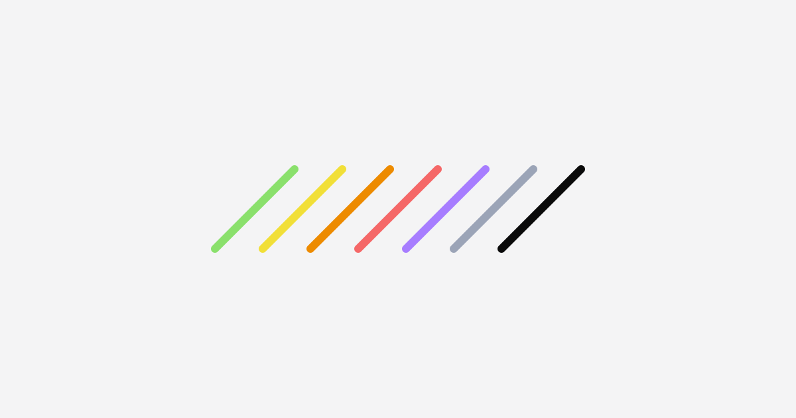

<div align="center">



# dev-lines

**See the lines. Before you ship the bug.**

A layout debug overlay — center/width/padding guides, depth-colored section outlines, labels, and spacing distances — for any page, in any framework. Zero dependencies.

[**lines.wiki**](https://lines.wiki) · [npm](https://www.npmjs.com/package/@dev-lines/core) · [MIT](./LICENSE)

</div>

---

## What it does

dev-lines draws a debug overlay *on top of* your page without mutating the DOM. Everything lives in one fixed, `pointer-events: none` layer, so your app is never touched and teardown is total.

- 🎯 **Guides** — viewport center cross, plus optional content-width and padding edges
- 🌈 **Outlines** — depth-colored rings around every flex/grid container (up to 12 nesting depths)
- 🏷️ **Labels** — name · tag · size · layout, shown on hover or all at once
- 📏 **Distances** — hold **Alt** to measure spacing from a box to its container
- 📋 **Agent handoff** — press **C** to copy a box's handle (name · selector · tag) to paste to an AI coding agent

## Quick start

```bash
npm i -D @dev-lines/core
```

```js
import { createDevLines } from "@dev-lines/core";

const dl = createDevLines({ contentWidth: 1280, paddingX: 24 });
dl.enable(); // or toggle with ⌘/Ctrl + Shift + L
```

### React

```tsx
import { DevLines } from "@dev-lines/core/react";

{process.env.NODE_ENV === "development" && <DevLines contentWidth={1280} paddingX={24} />}
```

## Keyboard

| Key | Action |
|-----|--------|
| `⌘/Ctrl + Shift + L` | toggle the overlay |
| `O` | toggle outlines |
| `G` | toggle guides |
| `L` | cycle labels (off → hover → all) |
| `C` | copy hovered box's handle |
| `Alt` (hold) | show spacing distances |
| `Esc` | disable |

Full options and the controller API are documented in **[packages/core/README.md](./packages/core/README.md)**.

## Naming boxes

| Attribute | Effect |
|-----------|--------|
| `data-devlines-name="Hero"` | give a box an explicit label |
| `data-devlines="outline"` | force an outline on a non-flex/grid element |
| `data-devlines="ignore"` | skip an element and its subtree |

When no explicit name is set, dev-lines derives one from `id` → `aria-label` → `data-component`/`data-testid` → first heading.

## Packages

This is a pnpm monorepo.

| Package | What |
|---------|------|
| [`@dev-lines/core`](./packages/core) | The framework-agnostic overlay engine + React wrapper. Published to npm. |
| [`@dev-lines/extension`](./packages/extension) | A Chrome (MV3) extension that runs the overlay on any page. |

## Develop

```bash
pnpm install
pnpm --filter @dev-lines/core build   # build the library
pnpm dev:demo                         # run the landing/demo site
```

## License

MIT © [wa-de](https://www.wa-de.org)
